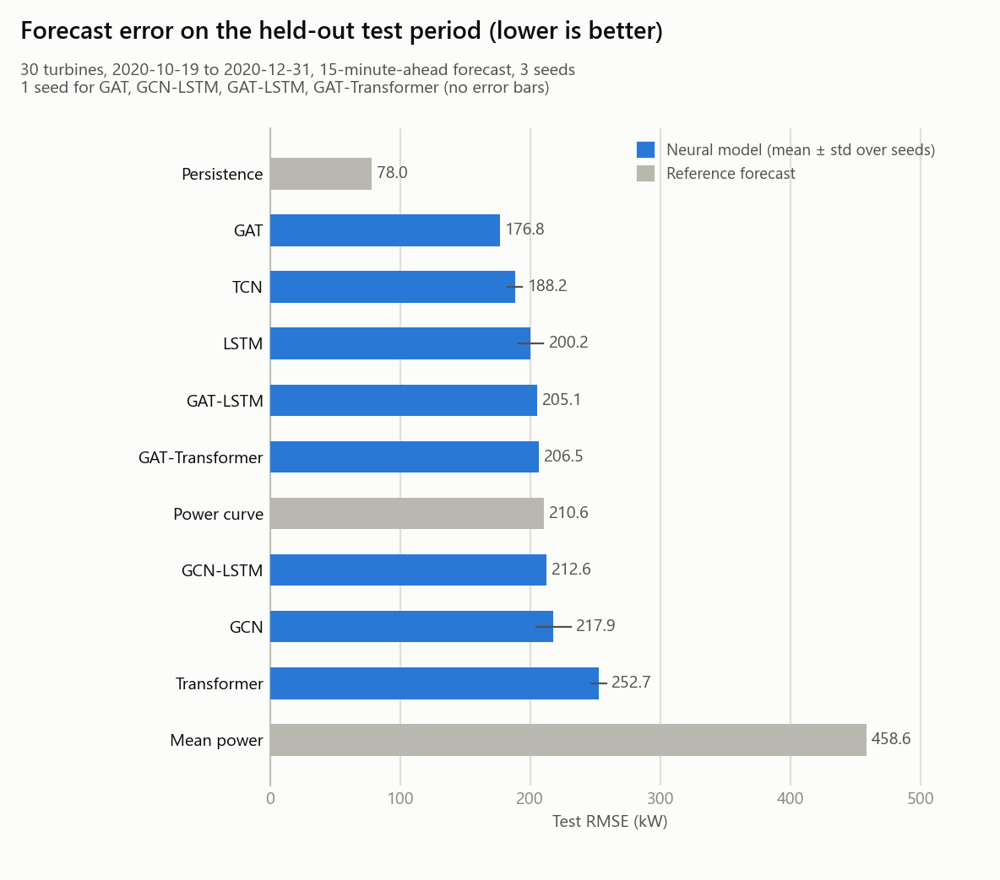
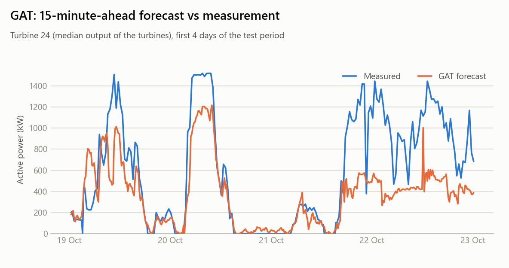
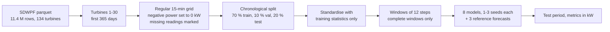
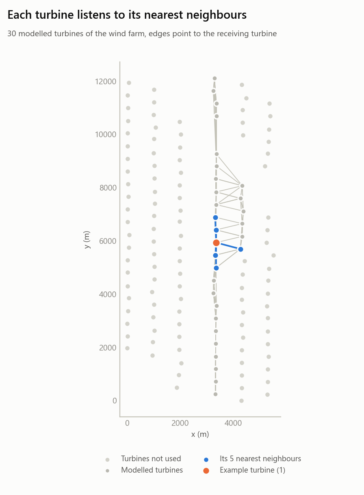

# Wind Power Forecasting (SDWPF)


[](https://github.com/Darani-karthik/wind-power-forecast/actions/workflows/tests.yml)

**Forecasting the power output of 30 wind turbines 15 minutes ahead: eight deep-learning models, from an LSTM to graph attention, compared with simple reference forecasts under one strict, chronological evaluation.**



## Overview

A wind farm operator needs to know how much each turbine will deliver in the next few minutes. This project uses the public [SDWPF dataset](data/README.md) (134 turbines of one wind farm, 2020-2021) and predicts the active power of each of 30 turbines **one step (15 minutes) ahead** from the previous 12 steps (3 hours) of five readings per turbine: wind speed, wind direction, external temperature, internal temperature and relative humidity.

Eight models share the same data pipeline, the same train / validation / test periods and the same metrics. The temporal models see one turbine at a time; the graph models also see the five nearest neighbouring turbines, because a turbine standing in the wake of another is affected by it.

| Model | Idea | Parameters |
|---|---|---|
| LSTM | one turbine's last 12 steps through an LSTM | 18,241 |
| TCN | three causal dilated convolutions over the 12 steps | 6,753 |
| Transformer | one self-attention block across the 12 steps, all turbines' readings side by side | 124,318 |
| GCN | two graph-convolution layers per time step, then a linear read-out over the 12 steps | 1,633 |
| GAT | two graph-attention layers (4 heads) per time step, then the same read-out | 5,601 |
| GCN-LSTM | graph convolution per time step, then an LSTM over time for every turbine | 8,673 |
| GAT-LSTM | graph attention per time step, then an LSTM | 13,089 |
| GAT-Transformer | graph attention per time step, then the self-attention block | 351,390 |

Three reference forecasts show what a model has to beat to be worth its complexity:

| Reference | What it does |
|---|---|
| Mean power | always the average power of the training period |
| Persistence | the last measured power, repeated. The neural models are **not** given past power, so this one has an information advantage |
| Power curve | the average power seen for the latest wind speed (0.5 m/s bins, learned on the training period) |

## Results

Scored on the **last 20 % of the year, 2020-10-19 to 2020-12-31: 208,390 (time step, turbine) pairs from 30 turbines.** Models are trained on January to mid-September and stopped early on mid-September to mid-October. Errors are in kW; neural models show the mean ± sample standard deviation over 3 seeds. GAT, GCN-LSTM, GAT-LSTM and GAT-Transformer were run with a single seed to save time, so their rows have no ± and are indicative only.

| Model | RMSE (kW) | MAE (kW) | R² | RAE | MAPE (%) | Parameters |
|---|---|---|---|---|---|---|
| Mean power | 458.6 | 372.9 | -0.000 | 0.999 | 68.8 | n/a |
| Persistence | 78.0 | 39.2 | 0.971 | 0.105 | 14.2 | n/a |
| Power curve | 210.6 | 117.7 | 0.789 | 0.315 | 29.5 | n/a |
| LSTM | 200.2 ± 10.0 | 107.2 ± 5.4 | 0.809 ± 0.019 | 0.287 ± 0.014 | 27.2 ± 0.6 | 18,241 |
| TCN | 188.2 ± 5.7 | 101.6 ± 1.6 | 0.831 ± 0.010 | 0.272 ± 0.004 | 28.7 ± 1.7 | 6,753 |
| Transformer | 252.7 ± 5.9 | 146.5 ± 3.1 | 0.696 ± 0.014 | 0.392 ± 0.008 | 36.9 ± 2.0 | 124,318 |
| GCN | 217.9 ± 13.4 | 119.3 ± 9.7 | 0.774 ± 0.028 | 0.320 ± 0.026 | 31.4 ± 2.6 | 1,633 |
| GAT | 176.8 | 100.8 | 0.851 | 0.270 | 25.7 | 5,601 |
| GCN-LSTM | 212.6 | 112.6 | 0.785 | 0.302 | 27.0 | 8,673 |
| GAT-LSTM | 205.1 | 103.7 | 0.800 | 0.278 | 27.1 | 13,089 |
| GAT-Transformer | 206.5 | 111.0 | 0.797 | 0.297 | 27.4 | 351,390 |

RAE is the summed absolute error relative to always predicting the test-period mean (1.0 = no better). MAPE only counts readings of at least 100 kW. The numbers come straight from [`results/summary.md`](results/summary.md); every individual run is in [`results/metrics/`](results/metrics).

**What the numbers say**

- **Past power beats everything here.** Persistence has an RMSE of 78.0 kW (R² 0.971), 2.3 times lower than the best neural model. The neural models are not given past power (see [Limitations](#limitations)), so this says more about the task setup than about the models.
- **Graph attention (GAT) is the best neural model**: 176.8 kW with one seed, 16 % below the wind-speed power curve (210.6 kW). The TCN is the best of the models with several seeds (188.2 ± 5.7, 11 % below the power curve). The GAT's 11 kW lead over the TCN is about two TCN standard deviations but rests on a single seed, so treat it as suggestive; `python -m src.run_all --models GAT --seeds 0 1 2` is the check.
- **The graph helps in one form only.** GAT beats graph convolution (GCN, 217.9 ± 13.4) by 41 kW. The three graph models that put an LSTM or a Transformer on top (GCN-LSTM, GAT-LSTM, GAT-Transformer, 205-213 kW) are no better than the plain LSTM (200.2 ± 10.0), within the seed spread of 6-13 kW seen on the models with several seeds.
- **The attention block needs the graph in front of it.** The plain Transformer (252.7 ± 5.9) is the weakest neural model, 20 % worse than the power curve; the same block behind a graph-attention layer (GAT-Transformer, one seed) scores 206.5.
- **Do not over-read small gaps.** With 3 seeds, or 1, and a spread of 6-13 kW, differences of about 15 kW or less between two models are not reliable.



The best model's 15-minute-ahead forecast for the turbine with the median output in the first four days of the test period (chosen by that rule, not for how good it looks). It tracks the first three days well but clearly under-forecasts the windy stretch on 22-23 October, about 400-600 kW against 800-1,400 kW measured.

### How much a short window misleads

The original prototype used only the first 60 days (January and February), where the training period is calm and the validation period stormy (mean wind 3.3 vs 7.9 m/s). The same pipeline on that window (all eight models, 3 seeds, [`results/days60/`](results/days60/summary.md)) gives a different picture. Test RMSE in kW; the two test periods are different, so compare the order of the models, not the absolute values:

| Model | First 60 days (3 seeds) | Full year 2020 |
|---|---|---|
| Persistence | 95.5 | 78.0 |
| GAT | 215.5 ± 9.5 | 176.8 (1 seed) |
| TCN | 276.4 ± 35.7 | 188.2 ± 5.7 |
| LSTM | 333.6 ± 7.1 | 200.2 ± 10.0 |
| GAT-LSTM | 299.8 ± 19.7 | 205.1 (1 seed) |
| GAT-Transformer | 250.4 ± 18.3 | 206.5 (1 seed) |
| Power curve | 306.4 | 210.6 |
| GCN-LSTM | 312.9 ± 12.5 | 212.6 (1 seed) |
| GCN | 213.6 ± 19.5 | 217.9 ± 13.4 |
| Transformer | 293.9 ± 8.9 | 252.7 ± 5.9 |
| Mean power | 542.6 | 458.6 |

On 60 days the GCN comes first of the eight and the LSTM last, with seed spreads of up to 36 kW; on the full year the GAT leads, the GCN drops to seventh and the LSTM climbs to third. A conclusion drawn from the 60-day window alone would have been wrong, which is why the full year is the default.

## Method



**Evaluation protocol**

- **Chronological split.** Train 2020-01-03 to 2020-09-12, validation 2020-09-12 to 2020-10-19, test 2020-10-19 to 2020-12-31. A model never sees a window from a later period than the one it is trained on, and the scalers are fitted on the training period only.
- **Only complete windows are scored.** A (time step, turbine) pair counts when the target and all 12 input steps of that turbine were recorded. That leaves 607,588 training, 104,278 validation and 208,390 test pairs. A lost sensor record is never filled in with a made-up value for scoring; for the graph models, missing readings of *neighbours* are replaced by the training mean.
- **Negative power is not generation.** An idle turbine draws a little power (down to -9.3 kW). These readings are set to 0 kW instead of deleting the rows, which would break the time series.
- **Metrics in kW.** RMSE, MAE, R², RAE (absolute error relative to always predicting the test mean) and MAPE, which only counts readings of at least 100 kW because the percentage error of a near-zero reading is meaningless. Forecasts below 0 kW are clipped to 0.
- **Training.** Mini-batch Adam (learning rate 0.001, 64 time steps per batch), at most 30 epochs, early stopping after 5 epochs without a better validation loss, and the best epoch is restored. Seeds 0, 1 and 2 for LSTM, TCN, Transformer and GCN, seed 0 only for the other four models; the tables show the mean ± sample standard deviation where there are several.
- **Time axis.** The data is sampled every **15 minutes in 2020** and every 10 minutes in 2021, so the pipeline reads the interval from the data and refuses a period that mixes both. April 2020 is missing from the dataset altogether; those steps are simply unusable and nothing is scored across them.

## Getting started

```bash
git clone https://github.com/Darani-karthik/wind-power-forecast.git
cd wind-power-forecast
python -m venv .venv && source .venv/bin/activate     # Windows: .venv\Scripts\activate
pip install -r requirements.txt
```

1. **Run the tests** (they use synthetic data, no download needed):

   ```bash
   pip install pytest
   python -m pytest -q
   ```

2. **Get the data.** Follow [`data/README.md`](data/README.md): two files from the Hugging Face mirror of the SDWPF dataset.

3. **Run the experiment.** No GPU is needed.

   ```bash
   python -m src.run_all --data-dir data              # all eight models, 3 seeds each, full year
   python -m src.run_all --days 60 --seeds 0          # quick run on the first 60 days
   python -m src.run_all --models LSTM GCN --seeds 0  # a subset
   python -m src.make_report                          # rebuild summary.md and the comparison figure
   ```

   Results are written to `results/`: one JSON file per model and seed in `results/metrics/`, `summary.md`, `data_summary.json` and the figures. Every option is listed by `python -m src.run_all --help`.

   **Run time** (8-thread CPU, measured): the committed full-year results took about 43 minutes of training in total, and the GAT is the slowest model at about 16 minutes per seed, so the default of 3 seeds for every model takes longer than that. The 60-day run of all eight models with 3 seeds took under 10 minutes. The committed full-year results were produced by two commands (training is deterministic for a given model and seed on the same machine):

   ```bash
   python -m src.run_all --models LSTM TCN Transformer GCN --seeds 0 1 2
   python -m src.run_all --models GCN-LSTM GAT GAT-LSTM GAT-Transformer --seeds 0
   ```

## Repository structure

```
wind-power-forecast/
├── src/
│   ├── data.py            time grid, validity mask, chronological split, scaling
│   ├── graph.py           k-nearest-neighbour turbine graph
│   ├── models/
│   │   ├── temporal.py    LSTM, TCN, Transformer
│   │   └── graph.py       GCN, GAT, GCN-LSTM, GAT-LSTM, GAT-Transformer
│   ├── baselines.py       mean, persistence and power-curve forecasts
│   ├── training.py        training loop, early stopping, scoring
│   ├── metrics.py         RMSE, MAE, R², RAE, MAPE in kW
│   ├── plots.py           figures
│   ├── make_report.py     metrics -> summary.md + comparison figure
│   ├── cli.py             command-line options
│   └── run_all.py         the whole experiment
├── tests/                 synthetic-data tests, incl. regression tests for the prototype's bugs
├── results/               metrics, summary, figures (days60/ = the 60-day sensitivity run)
├── docs/AUDIT.md          what was wrong in the original prototype and how it was fixed
└── data/README.md         how to get the dataset
```

## What changed from the original prototype

This repository started as a set of loose scripts. Before publishing it, every script was read and the prototype was run on the real data; the audit found problems that changed what the results meant, among them a graph built for different turbines than the data, a wrong sampling interval, 42 % of the rows thrown away, a TCN that only used the last of its 12 input steps, and a random train / test split of overlapping windows. All of them are fixed and covered by tests; the full list with the evidence is in [`docs/AUDIT.md`](docs/AUDIT.md). Numbers from the prototype are therefore not comparable with the ones above.

## Limitations

- **The neural models are not given past power.** They forecast from weather-type readings only, which is how the original project was set up. Persistence, which repeats the last measured power, is far more accurate. A natural next step is to add past power as an input; it would make the comparison with persistence fair.
- **One narrow slice of the farm.** Turbines 1-30 mostly stand in one north-south line (see the graph figure below), so the neighbour graph is close to a chain. The other 104 turbines are not used.
- **One year, one test season.** The test period is late autumn (19 October to 31 December 2020). Nothing here says how the models behave in other seasons or in 2021, which is sampled every 10 minutes.
- **Abnormal turbine states are not filtered out** (stops, curtailment, faults), apart from rows with missing sensor values. In the first four days of the test period, for example, turbine 1 reported 0 kW for 89 % of its readings with a wind speed above 5 m/s while the other turbines were producing; no model can foresee that.
- **Few seeds.** LSTM, TCN, Transformer and GCN were run with 3 seeds; GCN-LSTM, GAT, GAT-LSTM and GAT-Transformer with 1, to save time. Differences between neighbouring models in the ranking are often within one standard deviation.
- **The graph is distance only.** It does not use wind direction, so it cannot tell which neighbour is upwind.



## Data and citation

The dataset is not redistributed here (see [`data/README.md`](data/README.md) for where to get it and what was checked in the file). It was released with the KDD Cup 2022 challenge:

> Zhou et al. *SDWPF: A Dataset for Spatial Dynamic Wind Power Forecasting Challenge at KDD Cup 2022.* arXiv:2208.04360.

Please check the dataset's terms of use before reusing it.

## License

[MIT](LICENSE) for the code in this repository. The dataset has its own terms.
